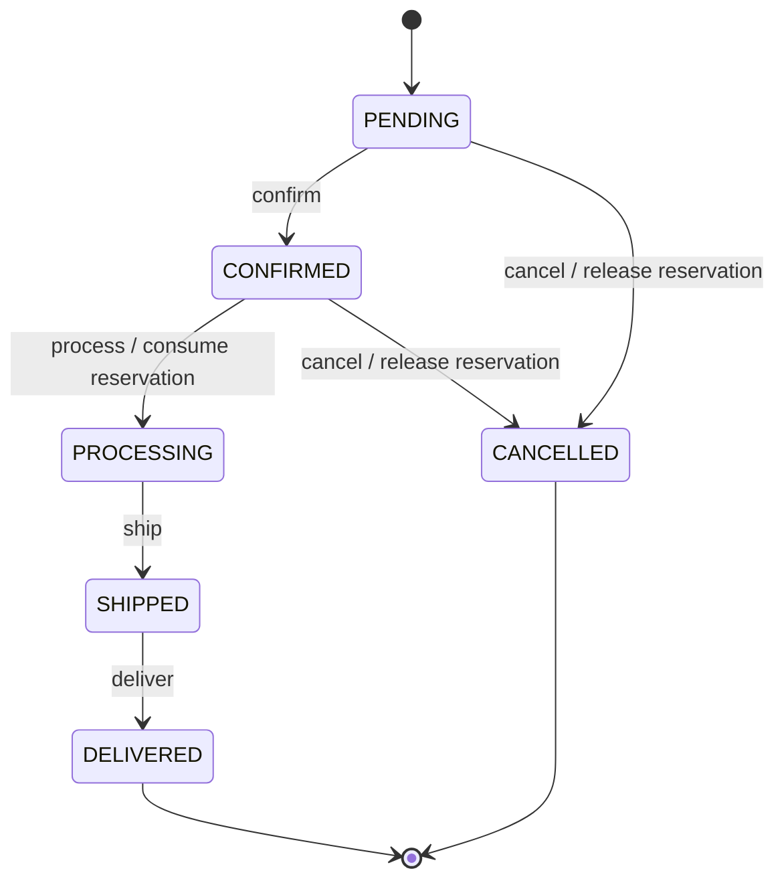

# Phase 3: Order domain and lifecycle

Order owns lifecycle, ownership, immutable Catalog product/delivery snapshots, and totals. Catalog owns current products; Inventory owns stock/reserve/release/consume. Order never accesses another service's database.

`src/domain/order-lifecycle.ts` is the authoritative policy. Only the six shown transitions are legal. Public repeated commands, skipped/backward transitions, and terminal transitions return `409 INVALID_ORDER_TRANSITION` through the shared nested error envelope. There is no generic status mutation endpoint. Command bodies cannot select another status.

## API and authorization

Gateway prefix is `/order`; service paths below omit that prefix.

| Method and path | Authorization |
| --- | --- |
| `POST /orders` | Authenticated customer; identity from trusted gateway context |
| `POST /orders/checkout` | Same; existing checkout `Idempotency-Key` contract preserved |
| `GET /orders/me` | Own orders only, newest first |
| `GET /orders/:id` | Own order only |
| `PATCH /orders/:id/cancel` | Own eligible order only |
| `PATCH /orders/:id/confirm` | ADMIN |
| `PATCH /orders/:id/process` | ADMIN |
| `PATCH /orders/:id/ship` | ADMIN |
| `PATCH /orders/:id/deliver` | ADMIN |
| `PATCH /internal/orders/:id/confirm` | Existing shared gateway secret; blocked at public gateway |
| `GET /internal/orders/:id/shipping-snapshot` | Existing shared gateway secret; blocked at public gateway |

Gateway and Order service both enforce privileged public commands. Gateway overwrites client identity/role/secret headers. Order's shared secret middleware protects all business routes before trusted user context is attached. Customers cannot choose authoritative identity via a body `userId`.

Unknown order returns `404 NOT_FOUND`; another customer's order returns existing `403 FORBIDDEN` without order data. No admin-wide list existed, so none was added. DTO fields and numeric money serialization remain compatible. Product name/slug/price/subtotal come from historical OrderItems. Internal `pendingStatus` and `reservationConsumed` never appear in public DTOs.

Internal confirmation retains the pre-existing safe retry response for an already confirmed order, without performing a self-transition. Existing Payment caller now uses this protected route; no Payment lifecycle implementation was added. Payment lifecycle hardening/integration is Phase 4. OrderStatus contains no payment statuses. Shipping remains a separate domain; its commands do not automatically advance Order.

## Creation and local transaction

1. Zod validates public requests and service-level creation inputs, including cart-derived inputs. Nonempty product IDs/items and positive integer quantities are required. Numeric string quantities remain compatible; booleans/null/arrays/NaN/fractions are rejected.
2. Aggregate duplicate products before Catalog/Inventory calls. Aggregated quantities must fit PostgreSQL `Int` (`2_147_483_647`). One snapshot per product is enforced by existing unique constraint.
3. Resolve all products through Catalog; missing/unpublished products fail the entire operation.
4. Validate Catalog snapshots and money before reservation. Prisma Decimal computes each `unitPrice * quantity` and total; prices have at most two decimal places, and all amounts fit existing Decimal(10,2). Client price/name/slug/subtotal/total/status fields are ignored.
5. Check aggregated availability, then reserve via Inventory's atomic public contract. Availability check is advisory; reserve rejects a concurrent stock shortfall.
6. One local Prisma transaction writes Order, every OrderItem, and delivery snapshot. No Inventory HTTP calls occur inside that transaction.
7. On failure, attempt compensation for every acknowledged reservation in reverse order, using stable Inventory operation IDs. Preserve original error even when release fails; log compensation failure with user/product/quantity/reservation ID and structured correlation context. Existing checkout compensation progress remains durable for same-key retry.

Unexpected failures return `500 INTERNAL_ERROR` / `Internal server error`. No Prisma error, stack, database URL, or downstream secret is returned. Existing Phase 2 request/trace propagation, structured logger, readiness, and shutdown paths remain in use.

## Cancellation, processing, and concurrency

New confirmed orders remain reserved. Processing consumes stock permanently through existing Inventory consume endpoint. Pending and confirmed cancellations release stock; processing/shipped/delivered cannot cancel.

Transitions use conditional Order DB updates on current status and command intent. Ordinary commands require no pending intent. Cancellation/processing first claim `pendingStatus` with a conditional update, then call Inventory, then conditionally finalize status and clear intent. No blind read/wait/update path exists.

Inventory uses existing persistent `InventoryOperation` uniqueness with `${orderId}:release:${productId}` and `${orderId}:consume:${productId}`. Concurrent or retried calls may repeat HTTP requests, but cannot repeat the stock mutation. A completed public cancellation rejects repeats before calling Inventory. Two competing commands cannot claim different intents; losers receive `409`. No Redis, distributed locks, Saga, broker, outbox, or generic idempotency-key framework was introduced.

## Failure and recovery

- Failed/partially completed release or consume does not finalize Order status. `pendingStatus` stays durable; conflicting commands receive `409 ORDER_COMMAND_IN_PROGRESS`.
- Retry the same command after downstream recovery. Inventory operation IDs deduplicate prior successful calls, including lost acknowledgements and Order final-update failures. Do not manually clear intent to allow the opposite operation: Inventory may already have applied part of the command.
- An incomplete processing command blocks cancellation even though public status still reads `CONFIRMED`. Processing has started once its intent is claimed.
- Local Order writes and Inventory calls cannot commit atomically. Process crashes, unknown reserve outcomes, prolonged outages, lost checkout progress, and direct-creation compensation failures may require operator reconciliation using logs and Inventory operation records. Direct creation has no new generic replay mechanism. Do not automatically retry a new direct-create request assuming earlier reservation failed.
- Creation compensation releases only acknowledged reservations. A reserve that applied but lost its acknowledgement is ambiguous; this synchronous architecture cannot guarantee automated recovery. Later infrastructure phases may address recovery, but none was added here.
- Checkout retains existing durable finalization/replay behavior; no Cart redesign was performed.

## Migration and existing data

Migration `20261007010000_order_lifecycle` adds fulfilment enum values, nullable command intent, and `reservationConsumed` (default false). Existing `CONFIRMED` orders are marked consumed because old confirmation deducted stock. Their cancellation returns `409 ORDER_INVENTORY_CONSUMED`; processing skips another consume and advances safely. No stock is recreated or released for those historical orders.

Before production rollout, reconcile any old pending orders whose pre-Phase-3 confirmation partially consumed Inventory; Order DB alone cannot infer remote partial outcomes. Apply additive migration and deploy regenerated Prisma client together. No development data reset/drop is needed or performed.

## Verification coverage

- Exhaustive 36-pair transition matrix, validation/aggregation/overflow, Decimal calculation, creation failures/compensation, safe errors, and Catalog/Inventory correlation.
- Real Order PostgreSQL: lifecycle, cancellation, ownership/RBAC/internal secret, duplicate aggregation, authoritative snapshots/totals, missing/unpublished products, stock failure, real transactional rollback, concurrent commands, partial/lost-acknowledgement release, and final DB-write retry.
- Docker gateway E2E: Order-only lifecycle/security/cancellation plus existing purchase/Payment/Shipping regression flow.
- Repository lint/typecheck/build, unit/integration/E2E scripts, migration drift, and production/test Compose configuration.

No remote push or Phase 4 work.

### Closeout verification (2026-10-07)

| Command | Result |
| --- | --- |
| `npm run lint` | Passed |
| `npm run typecheck` | Passed, all workspaces |
| `npm run test:unit` | Passed, 382 tests (80 Order tests) |
| `npm run test:integration` | Passed, 114 tests (40 Order tests); migration drift/deploy passed |
| `npm run test:e2e` | Passed, 5 gateway tests; all test stack services healthy |
| `npm run build` | Passed, all workspaces |
| `docker compose config --quiet` | Passed |
| `npm run test:stack:config` | Passed |
| `npm run test:db:config` | Passed |
| `git diff --check` | Passed; scoped diff reviewed |

Disposable DB/E2E stacks were removed by their existing scripts; no development databases/volumes were reset. Docker Desktop needed startup and sandbox access to its config/logs. Expanded E2E initially exceeded the unchanged auth rate limit; shared authenticated test fixtures resolved that failure, and the full suite passed afterward.

Existing matrix coverage gaps remain outside Phase 3: notification unit tests, and auth/catalog/notification integration tests. The matrix reports these explicitly; this closeout does not claim nonexistent suites passed.
