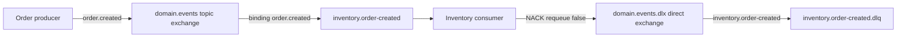

# Phase 5: RabbitMQ fundamentals

Phase 5 introduces broker infrastructure. Checkout, inventory reservation/release,
payment commands, protected HTTP order confirmation, and notifications still use
their existing synchronous paths. No domain service starts a broker consumer or
requires RabbitMQ readiness yet. Phase 6 owns the canonical event contract.

## Local infrastructure

The development stack uses the official `rabbitmq:4.3.5-management-alpine` image,
service `rabbitmq`, container/hostname `fitsupply-rabbitmq`. AMQP is available on
`127.0.0.1:5672`; optional management UI on `http://localhost:15672`. Applications
use AMQP only. Health checks ping the node and check listener connectivity.

```sh
cp docker/rabbitmq/.env.example docker/rabbitmq/.env
docker compose up -d --wait rabbitmq
```

Development credentials come from `docker/rabbitmq/.env`; persistent state uses
`rabbitmq_data` with a stable hostname. Changing environment credentials does not
rotate users already stored in that volume. No development volumes are reset by
the test runner. Keep credentials local; these examples are not production secrets.

Root `.env.example` documents broker client settings; helpers do not load `.env`
implicitly. Supply environment values through the owning service's existing config
loader when it starts using the broker. Host clients use `localhost`; containers
use `rabbitmq`. `readRabbitMqConfig` reuses `ConfigurationError` and
`requireEnvString`, requires a complete `amqp://` or `amqps://` URL, and validates
`RABBITMQ_CONNECTION_TIMEOUT_MS` (default 3000, range 1–60000). Invalid required
values fail before connection. AMQP URLs and credentials in errors are redacted
by the existing shared Pino logger. Never log message bodies or raw config objects.

Integration infrastructure extends `docker-compose.test-db.yml` with service
`rabbitmq-test`, container/hostname `fitsupply-rabbitmq-test`, disposable local user
`fitsupply_test`, and AMQP port `127.0.0.1:5673`. It has no persistent broker volume.
The existing root integration lifecycle starts, checks, and tears down both test
PostgreSQL and RabbitMQ. Test credentials are isolated from development.

## Concepts and exact topology

An exchange routes messages; a queue stores deliveries until consumed. Producers
publish to an exchange and routing key, not to a service address. A binding links
an exchange and matching routing pattern to a queue. Independent service queues
let each service receive and acknowledge its own copy. Multiple consumers on the
same queue instead share work; they do not each receive every message.

All exchanges and queues below are durable. Domain exchange `domain.events` is
`topic`; dead-letter exchange `domain.events.dlx` is `direct`. Queue declarations
set `x-dead-letter-exchange=domain.events.dlx` and `x-dead-letter-routing-key` to
the source queue name. Every source queue has a durable `<queue>.dlq`, bound to
the DLX with that exact source queue name.

| Service queue | Exact topic bindings | DLQ / DLX binding key |
| --- | --- | --- |
| `inventory.order-created` | `order.created` | `inventory.order-created.dlq` / `inventory.order-created` |
| `payment.inventory-reserved` | `inventory.reserved` | `payment.inventory-reserved.dlq` / `payment.inventory-reserved` |
| `order.payment-events` | `payment.succeeded`, `payment.failed` | `order.payment-events.dlq` / `order.payment-events` |
| `notification.order-events` | `order.confirmed`, `order.cancelled` | `notification.order-events.dlq` / `notification.order-events` |

`DOMAIN_ROUTING_KEYS` also reserves `inventory.reservation_failed`; no queue binds
that key yet. Routing vocabulary specifies neither payload schemas nor workflows.
Topic exchanges support `*` (one word) and `#` (zero or more words), but Phase 5
bindings deliberately use exact keys. Unbound keys are returned to our mandatory
publisher and reject its promise, even if the broker positively confirms receipt.

Conceptual future example, **not an implemented checkout path**:



`declareRabbitMqTopology(channel)` performs explicit exchange, queue and binding
assertions. Repeated compatible declarations succeed, including on new channels.
Incompatible definitions fail and close the offending channel; they are never
silently changed. Queue owners eventually declare their subscriptions during
startup. Phase 5 declares the entire foundation explicitly in isolated tests.

## Client and connection ownership

`amqplib` 2.2.0 is the only added runtime dependency. It supplies AMQP operations,
confirm channels and bundled TypeScript definitions without a messaging framework
or extra runtime dependencies. No separate type package is needed. See its
[API reference](https://amqp-node.github.io/amqplib/channel_api.html) and
[source](https://github.com/amqp-node/amqplib).

`openRabbitMq(config, logger)` connects once with a bounded socket/handshake
timeout. It uses plain `connect`, not the library's optional recovering connection.
Connection/channel errors are logged; failed startup rejects. Unexpected closure
is logged, and `isReady()` becomes false. Broker resource blocking also makes it
false and prevents new publishing until unblocked. The owning runtime must decide
when to restart and recreate connection, channels, topology and subscriptions.
No reconnect loop or generalized resilience policy exists in this phase.

`createChannel()` returns a tracked, error-observed channel for topology and explicit
infrastructure operations. Each `createPublisher()` has a dedicated confirm
channel. Each `subscribe(queue, handler, prefetch)` has a dedicated consumer channel.
The owner chooses its queue and handler; shared code contains no domain decisions.
`isReady()` describes connection availability, not individual subscription health,
DB health or HTTP readiness. Consumer cancellation is logged; future owning
services must treat failed required subscriptions as a readiness/startup failure.

## Publishing and consuming

`publisher.publish(exchange, routingKey, Buffer)` returns a promise. Messages are
persistent and mandatory. Success requires positive broker confirmation, no
unroutable return, and local channel drain if write backpressure was reported.
The local `publish` boolean is never treated as proof of broker acceptance.
One publish is in flight per publisher; callers can create separate publishers
when throughput requires it. Missing exchange, closed channel, negative confirm,
unroutable return and connection failure surface as rejected operations.

The confirm deadline is 3000 ms. Timeout rejects with an unknown-delivery outcome
and closes the publisher channel. A timed-out publish may have reached the broker;
blind retry can duplicate it. No automatic retry is attempted. Request context is
captured before serialization and propagated in AMQP headers `x-request-id` and
`x-trace-id`. Payload remains opaque bytes; no Phase 6 envelope exists yet.

`subscribe` configures `prefetch` (default 10, validated 1–65535) before `consume`
with `noAck: false`. Prefetch bounds unacknowledged deliveries per subscription,
limiting concurrent handler capacity and applying broker backpressure. Unlimited
prefetch is deliberately rejected. Consumer handlers run in independent shared
AsyncLocalStorage contexts using valid correlation headers, or generated UUIDs.
Logs include queue, routing key, redelivery flag and correlation.

- Handler resolves: ACK that delivery, after processing completes.
- Handler rejects/throws: log error; NACK that delivery with `requeue: false`.
- That rejection routes through the queue's DLX to its own DLQ.
- `requeue: true` makes a delivery eligible for redelivery; it does not add a retry
  delay or bound the number of attempts. Integration tests demonstrate it once,
  then ACK. The reusable failure policy never creates a poison-message requeue loop.

ACK and NACK belong to the delivering channel. ACK does not mean a business DB
transaction and publishing were atomic. A connection loss before ACK can redeliver
already processed work. DLQs here demonstrate rejection mechanics, with RabbitMQ
`x-death` metadata; no replay worker, retry counters or recovery tooling exists.

## Runtime lifecycle integration

No current service uses RabbitMQ; its readiness remains based on its existing
dependencies. Broker failure cannot break current HTTP checkout/payment startup.
When a service actually adopts it, validate config, connect, declare compatible
topology and start required subscriptions before declaring HTTP readiness.
Combine its existing readiness checks with broker and required subscription health.

The returned `close` callback fits existing `installShutdown.cleanup` directly:

```ts
const broker = await openRabbitMq(readRabbitMqConfig(process.env), logger);
const topologyChannel = await broker.createChannel();
await declareRabbitMqTopology(topologyChannel);
await topologyChannel.close();
// Later phase: owner starts its required subscriptions before HTTP readiness.
installShutdown({ server, logger, state: readiness, cleanup: [broker.close, closeDb] });
```

Existing shutdown first marks service stopping and drains HTTP. Broker cleanup
rejects new channel/subscription/publish work, cancels consumers, waits for current
handlers and current publisher confirms, closes remaining channels, then closes
connection. DB cleanup follows. Duplicate `close` calls share one promise.
Consumer `stop` also shares one promise. Consumer drain is bounded to 3000 ms;
expiry closes the channel, leaves unsettled deliveries available for redelivery,
and rejects cleanup. Late handler completion cannot ACK the closed channel.
The helper cannot cancel arbitrary handler side effects; handlers must eventually
support cooperative cancellation/idempotency before business adoption.

The existing process shutdown deadline of 8000 ms remains the outer bound for
channel/connection close and all resource cleanup. Cleanup errors propagate to
that contract. Real-broker tests exercise this hook with a real HTTP server,
duplicate signals, broker-before-DB ordering and clean resource closure.

## Guarantees and deferred problems

Publisher confirms and consumer acknowledgements are independent. Confirms mean
broker acceptance, not consumer processing or successful downstream DB mutation.
Persistent messages and durable queues establish the basic persistence intent;
this local single-node broker is not a replicated high-availability deployment.
Dead-letter routing here is ordinary classic-queue dead-lettering, not a
production guarantee that every dead-letter survives broker/target failure.
See RabbitMQ's [confirms](https://www.rabbitmq.com/docs/confirms) and
[dead-letter documentation](https://www.rabbitmq.com/docs/dlx).

Assume at-least-once delivery and possible duplicates. No exactly-once guarantee,
cross-service transaction or automatic compensation is claimed. If a DB commit
succeeds and publication fails, the event can be lost; a confirm does not close
that gap. If publication succeeds but its response is lost, retry can duplicate
the event. Future consumers need durable business idempotency. Transactional
Outbox in Phase 9 will address DB/event atomicity.

Deferred: Phase 6 event schema/envelope/versioning; Phase 7 event-driven checkout;
Phase 8 Saga compensation; Phase 9 Outbox; production reconnect/retry policies,
consumer idempotency, DLQ recovery, replay and operations. Stripe, Redis, Kafka,
Temporal, Camunda, Kubernetes and service mesh are outside this phase.

## Verification

Root unit matrix includes config validation, secret redaction, prefetch validation
and independent async correlation without Docker. Root integration matrix includes
real-broker topology, routing, confirms, mandatory returns, ACK/NACK, prefetch,
DLQs, correlation, failure handling, idempotent setup and shutdown tests, alongside
unchanged PostgreSQL service tests. Broker tests guard the disposable endpoint
before purging foundation queues. Root E2E still exercises synchronous checkout,
inventory and payment through the gateway. See [TESTING.md](../TESTING.md) for
commands and recorded results.
